# PIXIU
有關於貔貅（PIXIU）的任何問題都可以在這裏找到

# 貔貅（PIXIU）

# 注冊流程

### Step 1

打開 https://pixiu.tk/

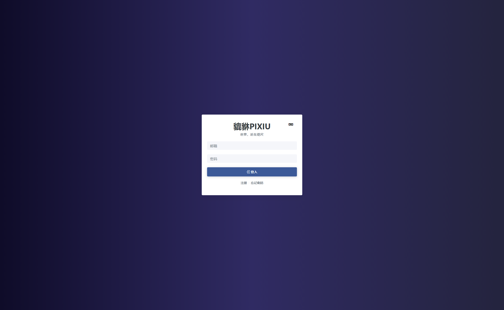

### Step 2

點擊登錄下方的注冊按鈕

### Step 3

填寫注冊郵箱密碼，如果有邀請碼的話也可以進行填寫，然後點擊注冊即可（請注意，我們對郵箱類型有做白名單限制，如果您的郵箱不在白名單内，請您更換一個處於白名單的郵箱，謝謝）

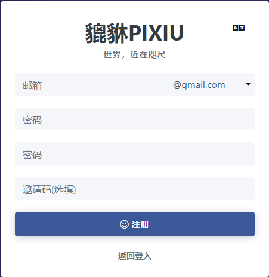

# 購買流程

### Step 1

進入到主界面

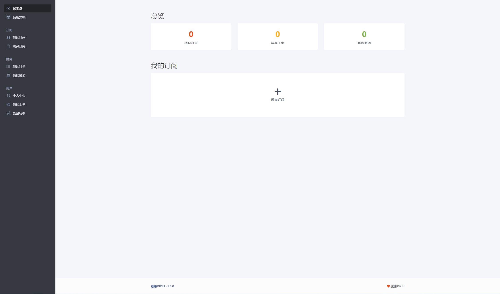

### Step 2

點擊主界面的“添加訂閲”或者左側邊欄的“購買訂閲”進行購買

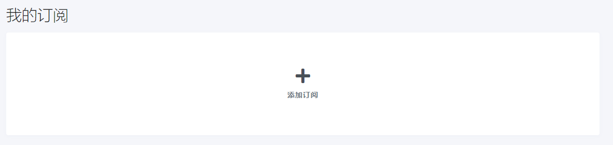

### Step 3

在購買訂閲界面選擇你需要的套餐，選擇完畢後點擊立即訂閲

### Step 4

如果你有優惠券的話，可以在右上角填寫並驗證，如果沒有的話，就直接點擊“下單”吧

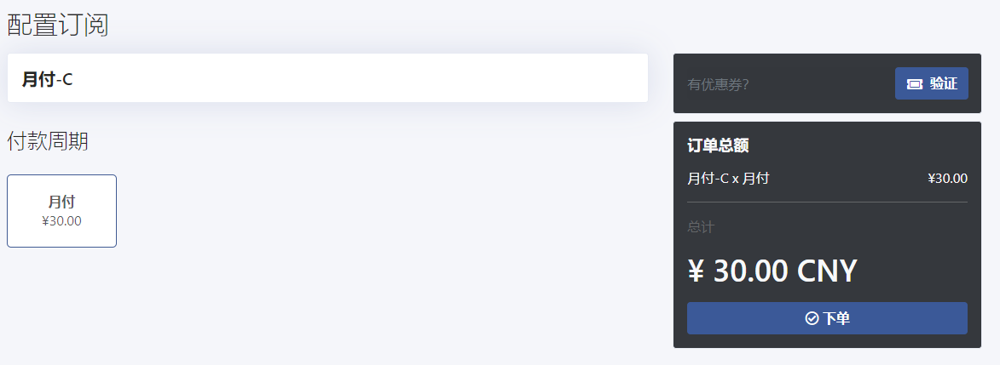

### Step 5

請注意，新購買的訂閲將會覆蓋原來的訂閲，并且無法撤回（注意：找管理也沒用）

### Step 6

如果您的賬戶中擁有一定的餘額，那麽支付時將會優先抵扣餘額，然後支付剩下的部分。點擊結賬將會跳轉到支付平臺

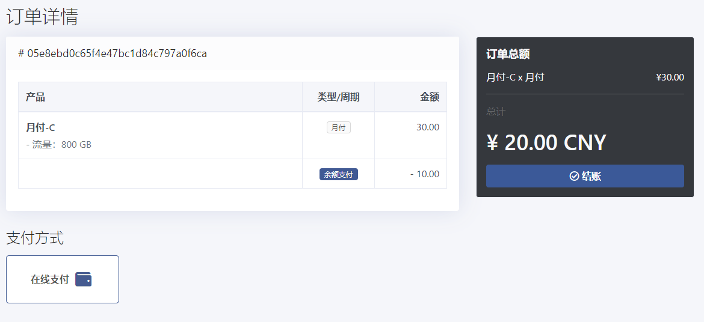

### Step 7

在這裏你可以選擇你想要的支付方式進行支付，由於是第三方支付平臺，到賬會有一定的延遲，如果超過5分鐘未到賬，請聯係客服，我們將會爲你手動開通

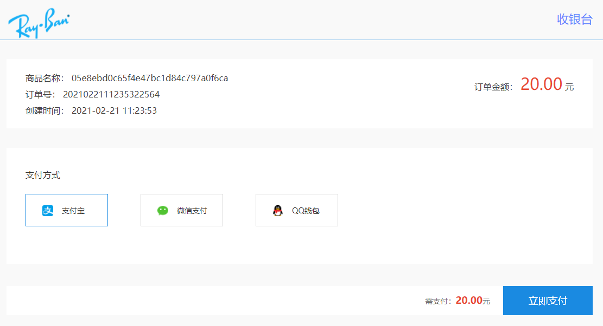

# 軟件安裝/導入訂閲

每個系統都有多款軟件，教程將只會介紹本人認爲比較方便好用的軟件，排序不分先後，本人盡量客觀的去描述一款軟件，如有得罪，多多包涵

## Clash For Windows

界面美觀，很小白，雖然軟件名字看起來好像只能用於Win，但其實作者已經開發出了Mac版本，作者也提到了，它只是一個名字

支持系統：Windows，Mac

下載地址（軟件是發佈在Github上面的，本人在底下會放出幾個加速下載地址，但是可能不是最新版，如有需要最新版可自行前往github下載支持）：

Github下載地址：https://github.com/Fndroid/clash_for_windows_pkg/releases

加速下載地址（截止2021.2.21）

Clash.for.Windows-0.14.6-ia32-win.7z

-https://download.fastgit.org/Fndroid/clash_for_windows_pkg/releases/download/0.14.6/Clash.for.Windows-0.14.6-ia32-win.7z

-https://pd.zwc365.com/seturl/https://github.com/Fndroid/clash_for_windows_pkg/releases/download/0.14.6/Clash.for.Windows-0.14.6-ia32-win.7z

Clash.for.Windows-0.14.6-mac.7z（Mac非安裝版）
-https://download.fastgit.org/Fndroid/clash_for_windows_pkg/releases/download/0.14.6/Clash.for.Windows-0.14.6-mac.7z

-https://pd.zwc365.com/seturl/https://github.com/Fndroid/clash_for_windows_pkg/releases/download/0.14.6/Clash.for.Windows-0.14.6-mac.7z

Clash.for.Windows-0.14.6-win.7z（Windows非安裝版）

-https://download.fastgit.org/Fndroid/clash_for_windows_pkg/releases/download/0.14.6/Clash.for.Windows-0.14.6-win.7z

-https://pd.zwc365.com/seturl/https://github.com/Fndroid/clash_for_windows_pkg/releases/download/0.14.6/Clash.for.Windows-0.14.6-win.7z

Clash.for.Windows-0.14.6.dmg（Mac安裝版）

-https://download.fastgit.org/Fndroid/clash_for_windows_pkg/releases/download/0.14.6/Clash.for.Windows-0.14.6.dmg

-https://pd.zwc365.com/seturl/https://github.com/Fndroid/clash_for_windows_pkg/releases/download/0.14.6/Clash.for.Windows-0.14.6.dmg

Clash.for.Windows.Setup.0.14.6.exe（Windows安裝版）

-https://download.fastgit.org/Fndroid/clash_for_windows_pkg/releases/download/0.14.6/Clash.for.Windows.Setup.0.14.6.exe

-https://pd.zwc365.com/seturl/https://github.com/Fndroid/clash_for_windows_pkg/releases/download/0.14.6/Clash.for.Windows.Setup.0.14.6.exe

Clash.for.Windows.Setup.0.14.6.ia32.exe

-https://download.fastgit.org/Fndroid/clash_for_windows_pkg/releases/download/0.14.6/Clash.for.Windows.Setup.0.14.6.ia32.exe

-https://pd.zwc365.com/seturl/https://github.com/Fndroid/clash_for_windows_pkg/releases/download/0.14.6/Clash.for.Windows.Setup.0.14.6.ia32.exe

### 教程（本人Windows系統，Mac沒辦法做，但是基本操作差不多）：

##### Step 1

雙擊exe運行軟件后，軟件不會有窗口顯示，他會出現在右下角的托盤，是一個貓貓

##### Step 2

打開后界面長這樣，軟件為全英文，作者暫時沒有更新中文，本文將主要説明幾點常用的地方

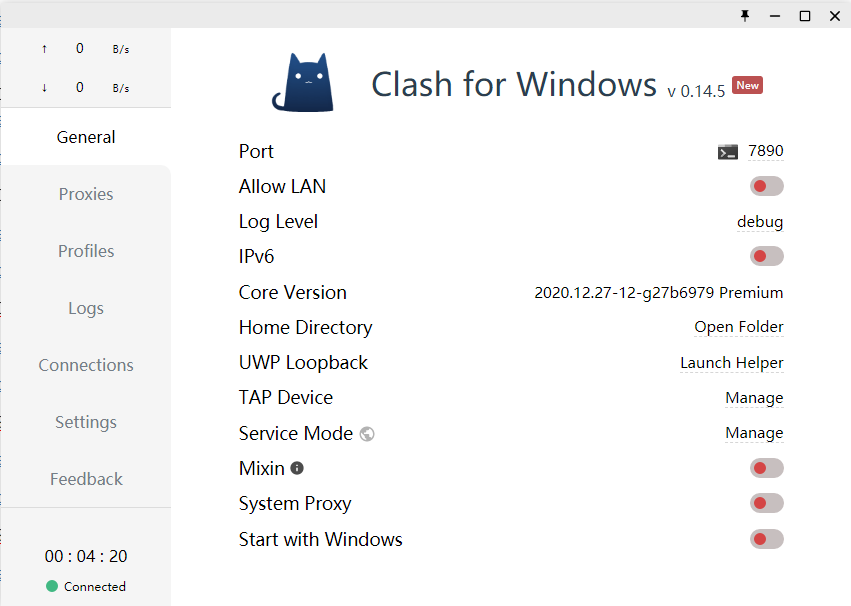

##### Step 3

軟件開啓後，回到網站，點擊左側邊欄的“我的訂閲”

##### Step 4

在這個界面你將能看到你的套餐到期時間，餘額，節點等信息，點擊“一鍵訂閲”按鈕

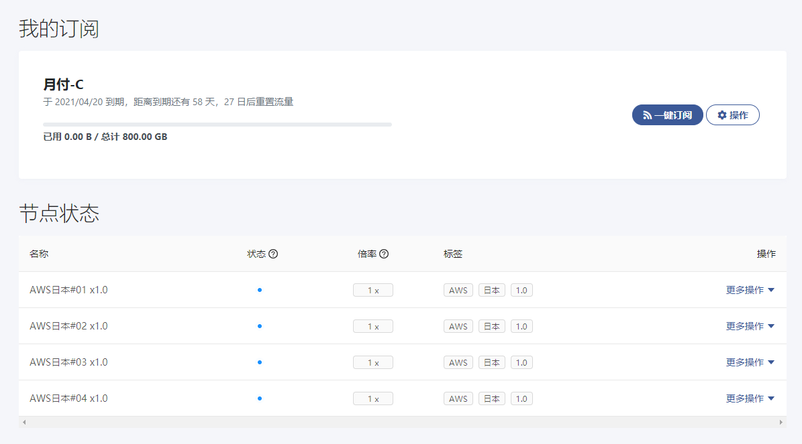

##### Step 5

然後點擊“導入到ClashX”，此時一些瀏覽器將會阻止打開Clash For Windows，允許它們

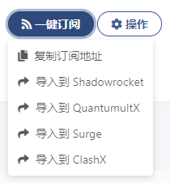

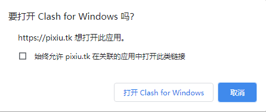

##### Step 6

此時軟件將會轉到Profiles選項，在這個界面，你可以管理你的訂閲地址，更新你的訂閲

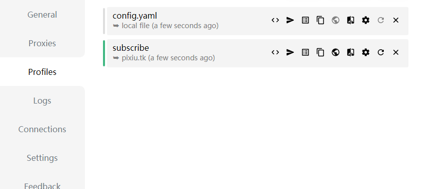

其中，config.yaml為軟件自帶，你可以選擇刪除，點擊選項卡最右邊的“x”即可刪除

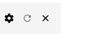

而第二行的subscribe則爲我們的訂閲

你可以點擊右側的刷新按鈕更新訂閲，請注意保持訂閲的更新，避免出現節點不可用等情況

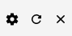

##### Step 7

選擇並點擊左側邊欄的Proxies選項

如果你不想自行切換節點的話，現在由軟件定義的規則已經幫你選好了節點，如果你想自行切換的話，請往下看

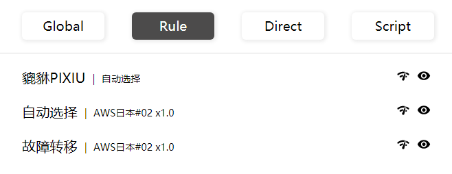

點擊左上角的Global

在這個界面，你將能夠切換節點，只需要點擊你想要的節點即可，但需要注意，CFW的節點測速功能并不是那麽準確，僅供參考，同時以下這些節點為CFW自帶，無法使用，請勿切換到這些節點上面

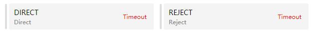

##### Step 8

點擊左側邊欄的General，回到主界面

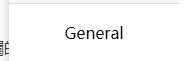

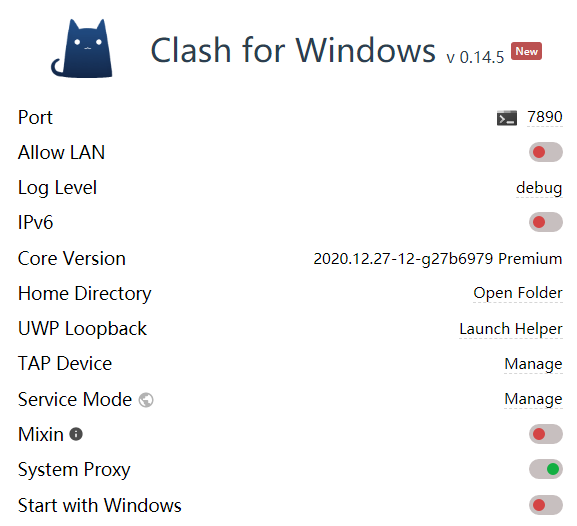

其中，

System Proxy可以理解爲開關

Start with WIndows開機自啓動

##### Step 9

在開啓后右下角的貓貓會變成黃色的，可以以此判斷軟件狀態

其餘的，Google
